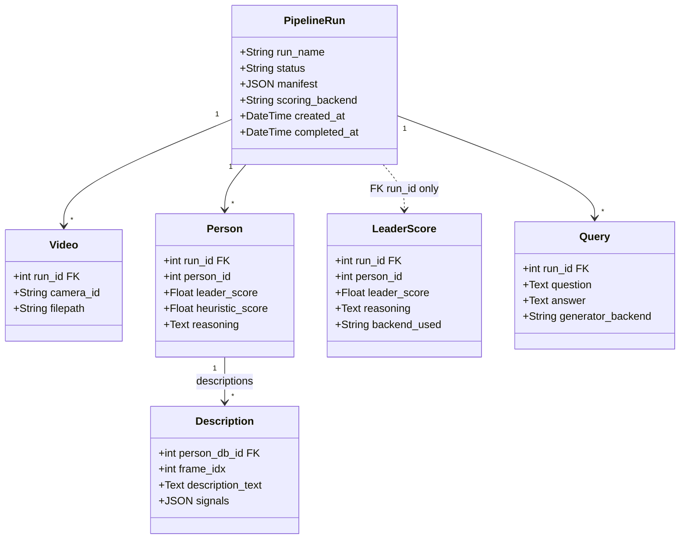
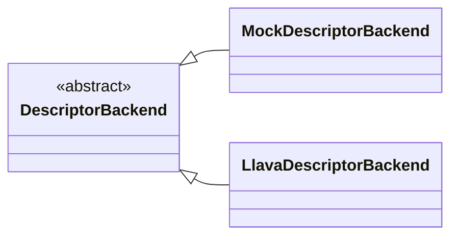

# Class diagram — domain model (what the code actually persists)

The backend stores data with **SQLAlchemy** models in `src/database/models.py`. The multi-camera workflow is **not** a `MulticamPipeline` class: it is the function `run_multicam_pipeline()` plus plain functions (`run_tracking`, `run_description_pipeline`, etc.). This diagram only shows **real ORM types** and relationships.

**Note:** `LeaderScore` references `pipeline_runs.id`, but `PipelineRun` does not declare a `relationship()` to `LeaderScore` in code—only the foreign key exists on the `leader_scores` table.

---

## Optional: description backends (small OO slice)

`llava_descriptor.py` uses a strategy-style backend, not “Llava inherits Mock”.

