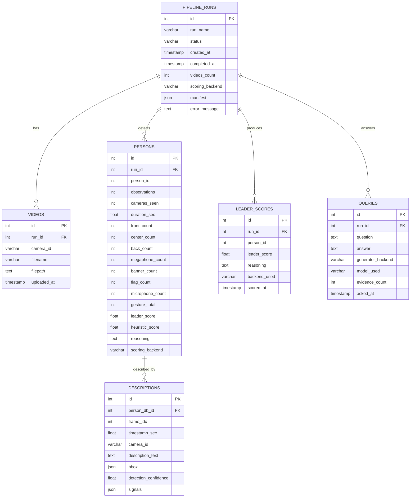

# Database ERD — PostgreSQL Schema

```mermaid
erDiagram
    PIPELINE_RUNS {
        int id PK
        varchar run_name
        varchar status
        timestamp created_at
        timestamp completed_at
        int videos_count
        varchar scoring_backend
        json manifest
        text error_message
    }

    VIDEOS {
        int id PK
        int run_id FK
        varchar camera_id
        varchar filename
        text filepath
        timestamp uploaded_at
    }

    PERSONS {
        int id PK
        int run_id FK
        int person_id
        int observations
        int cameras_seen
        float duration_sec
        int front_count
        int center_count
        int back_count
        int megaphone_count
        int banner_count
        int flag_count
        int microphone_count
        int gesture_total
        float leader_score
        float heuristic_score
        text reasoning
        varchar scoring_backend
    }

    DESCRIPTIONS {
        int id PK
        int person_db_id FK
        int frame_idx
        float timestamp_sec
        varchar camera_id
        text description_text
        json bbox
        float detection_confidence
        json signals
    }

    LEADER_SCORES {
        int id PK
        int run_id FK
        int person_id
        float leader_score
        text reasoning
        varchar backend_used
        timestamp scored_at
    }

    QUERIES {
        int id PK
        int run_id FK
        text question
        text answer
        varchar generator_backend
        varchar model_used
        int evidence_count
        timestamp asked_at
    }

    PIPELINE_RUNS ||--o{ VIDEOS : "has"
    PIPELINE_RUNS ||--o{ PERSONS : "detects"
    PIPELINE_RUNS ||--o{ LEADER_SCORES : "produces"
    PIPELINE_RUNS ||--o{ QUERIES : "answers"
    PERSONS ||--o{ DESCRIPTIONS : "described_by"
```
