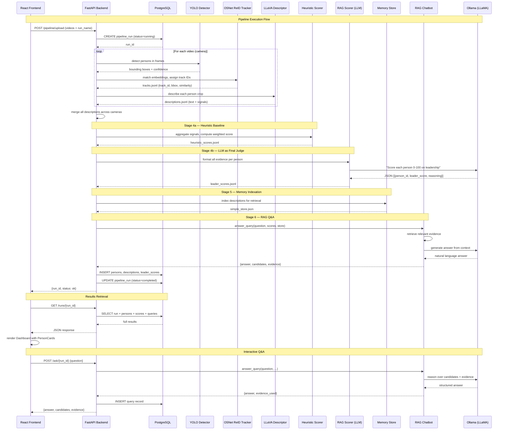

# Sequence Diagram — Full Pipeline Flow

```mermaid
sequenceDiagram
    participant U as React Frontend
    participant API as FastAPI Backend
    participant DB as PostgreSQL
    participant YOLO as YOLO Detector
    participant OSNET as OSNet ReID Tracker
    participant LLAVA as LLaVA Descriptor
    participant SCORER as Heuristic Scorer
    participant RAG as RAG Scorer (LLM)
    participant MEM as Memory Store
    participant CHAT as RAG Chatbot
    participant OLLAMA as Ollama (LLaMA)

    Note over U,OLLAMA: Pipeline Execution Flow

    U->>API: POST /pipeline/upload (videos + run_name)
    API->>DB: CREATE pipeline_run (status=running)
    DB-->>API: run_id

    loop For each video (camera)
        API->>YOLO: detect persons in frames
        YOLO-->>API: bounding boxes + confidence
        API->>OSNET: match embeddings, assign track IDs
        OSNET-->>API: tracks.jsonl (track_id, bbox, similarity)
        API->>LLAVA: describe each person crop
        LLAVA-->>API: descriptions.jsonl (text + signals)
    end

    API->>API: merge all descriptions across cameras

    Note over API,SCORER: Stage 4a — Heuristic Baseline
    API->>SCORER: aggregate signals, compute weighted score
    SCORER-->>API: heuristic_scores.jsonl

    Note over API,RAG: Stage 4b — LLM as Final Judge
    API->>RAG: format all evidence per person
    RAG->>OLLAMA: "Score each person 0-100 on leadership"
    OLLAMA-->>RAG: JSON [{person_id, leader_score, reasoning}]
    RAG-->>API: leader_scores.jsonl

    Note over API,MEM: Stage 5 — Memory Indexation
    API->>MEM: index descriptions for retrieval
    MEM-->>API: simple_store.json

    Note over API,CHAT: Stage 6 — RAG Q&A
    API->>CHAT: answer_query(question, scores, store)
    CHAT->>CHAT: retrieve relevant evidence
    CHAT->>OLLAMA: generate answer from context
    OLLAMA-->>CHAT: natural language answer
    CHAT-->>API: {answer, candidates, evidence}

    API->>DB: INSERT persons, descriptions, leader_scores
    API->>DB: UPDATE pipeline_run (status=completed)
    API-->>U: {run_id, status: ok}

    Note over U,DB: Results Retrieval

    U->>API: GET /runs/{run_id}
    API->>DB: SELECT run + persons + scores + queries
    DB-->>API: full results
    API-->>U: JSON response
    U->>U: render Dashboard with PersonCards

    Note over U,OLLAMA: Interactive Q&A

    U->>API: POST /ask/{run_id} {question}
    API->>CHAT: answer_query(question, ...)
    CHAT->>OLLAMA: reason over candidates + evidence
    OLLAMA-->>CHAT: structured answer
    CHAT-->>API: {answer, evidence_used}
    API->>DB: INSERT query record
    API-->>U: {answer, candidates, evidence}
```
