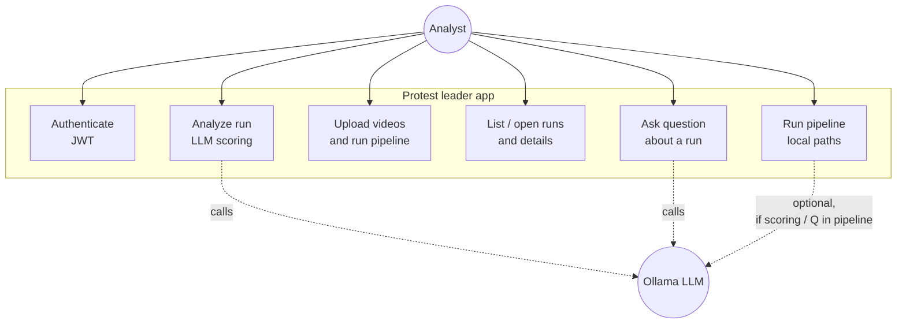

# Use case diagram — analyst vs external LLM

**Actor:** a human **Analyst** (or operator) using the HTTP API / React UI.  
**Secondary actor:** **Ollama** (or any HTTP LLM the app calls)—only involved when a feature actually invokes the model (RAG scoring, `/analyze`, `/ask`, optional pipeline question).

The diagram stays at **user goals**, not internal steps (YOLO/OSNet/LLaVA are implementation details inside “Run pipeline”).

**Mapping to FastAPI (rough):**

| Use case | Typical endpoint |
|----------|------------------|
| Authenticate | `POST /auth/token`, `GET /auth/me` |
| Run pipeline | `POST /pipeline/run` |
| Upload and run | `POST /pipeline/upload` |
| List / open runs | `GET /runs`, `GET /runs/{id}`, persons, crops, query history |
| Analyze run | `POST /analyze/{run_id}` |
| Ask question | `POST /ask/{run_id}` |

**Not drawn:** PostgreSQL/SQLite is infrastructure the API uses to persist runs; the analyst does not talk to the DB directly.
